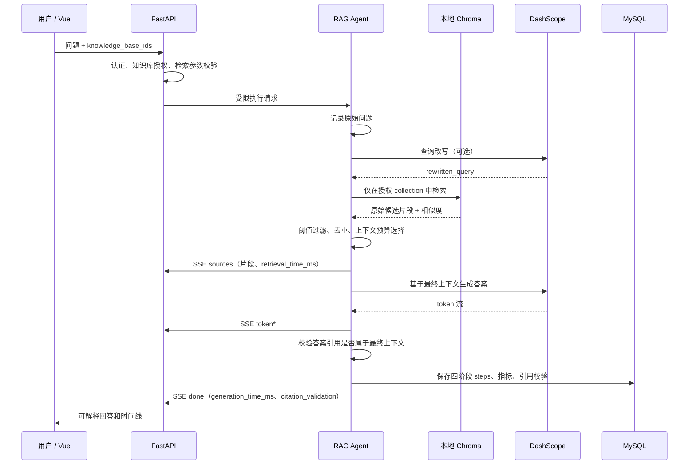

# RAG Agent 数据流与引用时间线

```mermaid
sequenceDiagram
    participant U as 用户 / Vue
    participant A as FastAPI
    participant G as RAG Agent
    participant V as 本地 Chroma
    participant D as DashScope
    participant M as MySQL

    U->>A: 问题 + knowledge_base_ids
    A->>A: 认证、知识库授权、检索参数校验
    A->>G: 受限执行请求
    G->>G: 记录原始问题
    G->>D: 查询改写（可选）
    D-->>G: rewritten_query
    G->>V: 仅在授权 collection 中检索
    V-->>G: 原始候选片段 + 相似度
    G->>G: 阈值过滤、去重、上下文预算选择
    G->>A: SSE sources（片段、retrieval_time_ms）
    G->>D: 基于最终上下文生成答案
    D-->>G: token 流
    G->>A: SSE token*
    G->>G: 校验答案引用是否属于最终上下文
    G->>M: 保存四阶段 steps、指标、引用校验
    G->>A: SSE done（generation_time_ms、citation_validation）
    A-->>U: 可解释回答和时间线
```

失败路径只发送一个 `error` 事件并结束；不得用外部知识补全答案。`sources`、`token`、`done` 的顺序由 SSE 合约测试保护。
