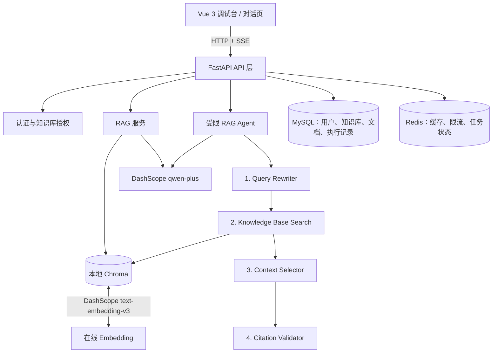

# 本地知识库 RAG Agent 系统架构

```mermaid
flowchart TB
    UI["Vue 3 调试台 / 对话页"] -->|"HTTP + SSE"| API["FastAPI API 层"]
    API --> AUTH["认证与知识库授权"]
    API --> RAG["RAG 服务"]
    API --> AGENT["受限 RAG Agent"]
    AGENT --> QR["1. Query Rewriter"]
    QR --> KB["2. Knowledge Base Search"]
    KB --> CS["3. Context Selector"]
    CS --> CV["4. Citation Validator"]
    RAG --> CHROMA[("本地 Chroma")]
    KB --> CHROMA
    RAG --> LLM["DashScope qwen-plus"]
    AGENT --> LLM
    API --> MYSQL[("MySQL：用户、知识库、文档、执行记录")]
    API --> REDIS[("Redis：缓存、限流、任务状态")]
    CHROMA <-->|"DashScope text-embedding-v3"| EMB["在线 Embedding"]
```

边界：文档、元数据和向量索引在本地；只有 LLM 与 Embedding 经 DashScope 在线服务调用。Agent 不包含外部搜索、网页访问、Shell 或任意 HTTP 工具。
